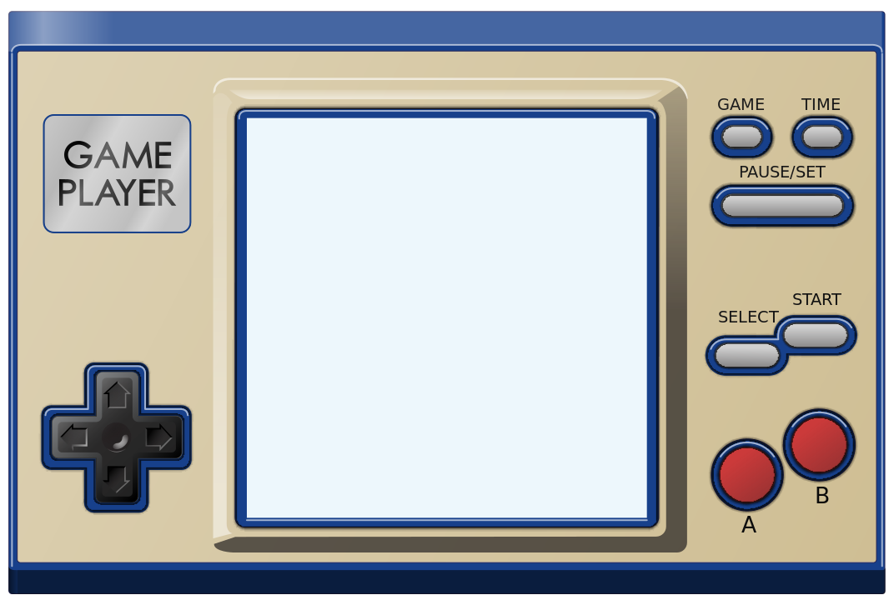

# gameplayer

---

## Overview

> **gameplayer** is a development tool kit to make video game development in the R programming language easy and accessible for developers of all skill levels.
The objective of the **gameplayer** package is have a re-usable and repeatable framework for R developers to create 2d style video games that are customizable with minimal coding.
The primary aim of the **gameplayer** package is to allow the beginner all the way up to the expert level R developer to focus more on the graphic design elements of gaming while
still incorporating some of the necessary skills for the nuts and bolts of game development

---

## Project Roadmap

### gamplayer Version 1.0.0 

**gameplayer** 1.0.0 will feature core functionality to set up the directory structure of a basic battle video game with story mode and battle mode along with helper functions to select a game device skins and generate game screens with user defined images and text

#### Core Functionality

##### **1. Initialize Game**

Functionality to create folder directory and sub-directory structure  

1. `video_game_init()` - Create folder directory for video game
2. `battle_story_game_init()` - Create sub-folders for video game

##### **2. Game Device Selection**

Functionality to choose game device skin (currently only one device skin available)

1. `game_device_init()` - Selection of game device skin to use for video game

##### **3. Base Layers**

Functionality to create the base layers for game screens

1. `base_game_boot_draw()` - Draw the base layer for the *Game Boot* plot
2. `base_title_draw()` - Draw the base layer for the *Game Title* plot
3. `base_mode_select_draw()` - Draw the base layer for the *Game Mode* plot

##### **4. Game Boot Screen**

Functionality to create the boot screen images for the game device

1. `game_boot()` - Create the boot screen with the a boot screen logo animation

##### **5. Loading Screens**

Functionality to create the in between loading screen images

1. `game_loading_screen_wide_view()` - Creation of a game loading screen for videos of with a wide (16:9) aspect ratio
2. `game_loading_screen_long_view()` - Creation of a game loading screen for videos of with a long (9:16) aspect ratio

##### **6. Title Screen**

Functionality to place user defined images on the game `base_title_draw()` screen

1. `title_character_left()` - Sprite on the left side of the title screen
2. `title_character_right()` - Sprite on the right side of the title screen
3. `logo_left()` - Logo sprite on the top left side of the title screen
4. `logo_right()` - Logo sprite on the top right side of the title screen
5. `logo_middle()` - Logo sprite on the top middle part of the title screen
6. `logo_left_bottom()` - Logo sprite on the bottom left side of the title screen
7. `logo_right_bottom()` - Logo sprite on the bottom right side of the title screen
8. `logo_middle_bottom()` - Logo sprite on the bottom middle part of the title screen
9. `logo_middle_center()` - Logo sprite in the middle of the title screen
10. `press_start_on()` - Add text annotation for PRESS START text on the title screen

##### **7. Menu Screen**

Functionality to place user defined images on the game `base_mode_select_draw()` screen

1. `menu_sprite_large_left()` - Large sprite on the left side of the menu screen
2. `menu_sprite_small_right()` - Small sprite on the bottom right part of the screen
3. `base_two_mode_battle_game_menu_1()` - Add text annotation for default story mode text location
4. `base_two_mode_battle_game_menu_2()` - Add text annotation for default battle mode text location

##### **8. Character Select Screen**

Functionality to create character select screen

1. `character_select_16()` - Creation of a 16 character select screen image
2. `character_select_16_selected()` - Highlighting of a single character selected in a 16 character select screen

##### **9. Character Versus Screen**

Functionality to create the character versus screen

1. `character_vs_profiles()` - Create character versus screen image with profile picture images
2. `character_vs_no_profiles()` - Create character versus screen image with no profile picture images

##### **10. Map Select Screen**

Functionality to create the map select screen

1. `map_select()` - Creation of 4 map select screen image
2. `map_selected()` - Highlighting of a single map selected in a 4 map select screen

##### **11. Character Setter Helper Functions**

Functionality to set images to use as battle characters within battle mode corresponding with profiles used in the `character_select_16()` screen

##### **12. Miscellaneous Helper Functions**

Functionality miscellaneous helper functions for game design

1. `get_photo()` - get an image to use for sprites in from a folder directory
2. `get_photo_random()` - get a random image to use for sprites from a folder directory 

##### **13. Image Setter Helper Functions**

Functionality to place the images generated into the proper locations of the video game development folder structure

##### **14. Game Play**

Functionality to create live reactive game play

---

